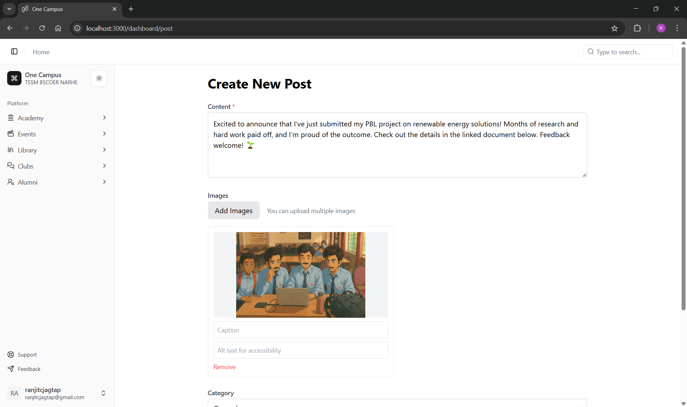

# One Campus: Streamlining College Life

## A Unified Platform for Attendance, Library, and Campus Updates

One Campus is an all-in-one web application designed to simplify campus management for students and teachers alike. From marking attendance with a single tap to tracking library due dates with live data from Koha’s MySQL database, this project brings efficiency and clarity to college workflows. Built with a modern tech stack including Next.js, TypeScript, MongoDB, and Google App Script, One Campus provides a clean, accessible interface for attendance tracking, student data insights, library notifications, and campus-wide posting—without the mess of traditional social media.

### Built with

- [Next.js](https://nextjs.org/)
- [Tailwind CSS](https://tailwindcss.com/)
- [shadcn/ui](https://ui.shadcn.com/)
- **Next.js**: Framework for building server-rendered React applications
- **Tailwind CSS**: Utility-first CSS framework for rapid UI development
- **shadcn/ui**: Reusable, customizable UI components

### Requirements

- **Node.js**: >= 22.14.0
- **npm**: >= 10.9.2

### Features

- **Marking Attendance**: Teachers can quickly mark and submit attendance using a tap-to-mark system, exported seamlessly to Excel via Google App Script.
- **Student Data**: Students can view their attendance records in real-time.
- **Library Integration**: Live data from Koha’s MySQL database delivers notifications like book due dates.
- **Posting**: A streamlined posting feature ensures campus updates are accessible to all, with images uploaded via Cloudinary.

## Feature Screenshots

|                  |                           |
| :---------------------------------------------------------------------: | :---------------------------------------------------------------------: |
|                             _Landing Page_                              |                             _Creating Post_                             |
|      |     |
|                          _Student Attendance_                           |                            _Student Library_                            |
|  |  |
|                          _Teacher Attendance_                           |                          _Teacher Attendance_                           |

### Installation and Usage (For Contributors)

Want to improve One Campus? Here’s how to get started:

1. **Clone the Repository**:
   ```bash
   git clone https://github.com/ranjitcj/One-Campus.git
   cd One-Campus
   ```
2. **Install Dependencies**:
   ```bash
   npm install
   ```
3. **Set Up Environment**:

   - Create a `.env.local` file with your MongoDB URI, Google App Script credentials, and MySQL (Koha) connection details.
   - Example:

     ```
      MONGODB_URI=
      NEXTAUTH_SECRET=
      EMAIL_API=
      CLOUDINARY_CLOUD_NAME=
      CLOUDINARY_API_KEY=
      CLOUDINARY_API_SECRET=

     ```

4. **Run Locally**:
   ```bash
   npm run dev
   ```
   Open `http://localhost:3000` in your browser.
5. **Build for Production**:
   ```bash
   npm run build
   npm start
   ```

### Contributor Expectations

We’d love your help to make One Campus even better! Here’s how to contribute:

- **Issues**: Report bugs or suggest features by creating an issue in the GitHub issue queue.
- **Pull Requests**: Submit fixes or enhancements via pull requests.
- **Commit Style**: Squash commits for cleaner history. Example: `git rebase -i` before pushing.
- **Code Standards**: Follow TypeScript and React best practices. Run `npm run lint` before submitting.

### Known Issues

- **Attendance Export**: Occasional delays in Google Drive sync due to API rate limits.
- **Library Notifications**: MySQL connection may timeout under heavy load—optimization in progress.
- **Mobile View**: Posting UI needs better responsiveness for smaller screens.

---

**Tech Stack**: TypeScript, TSX, Next.js, MongoDB, React, Google App Script, Google Drive, Excel, Koha, MySQL

Check out the repo: [https://github.com/ranjitcj/One-Campus](https://github.com/ranjitcj/One-Campus)
